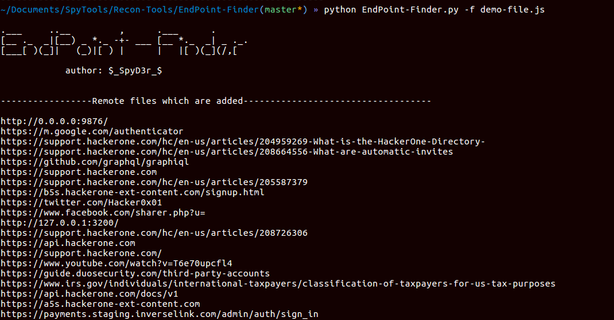
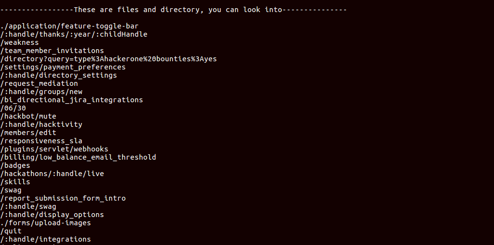

# EndPoint-Finder
During reconnaissance(recon) process it is very helpful to get idea of all end-points of JavaScript files. These days you have seen that the JavaScript files having unformatted code, This tool will extract all that links in those files.  
And also you can get blog on the same [Blog on EndPoint-Finder](https://spyclub.tech/2018/blog-on-endpoint-finder/)

## About
This is python script to disclose end-points in JavaScript files.  
This discloses:  
1. Full URLs (starting with `http, https, file, php, ftp`)
2. Dotted URLs (starting with `/* or ./* or ../*`)
3. URLs having extension(`js, php, xml, png, etc...`)
4. URL or directory having any `parameters`
5. And some `expected directories` which can be exist!!

## Dependencies
1. [Requests](http://docs.python-requests.org/en/master/) module in python
2. [Argparse](https://docs.python.org/3/library/argparse.html) module in python

## Usage
| Short Form  | Long Form  |        Description             |
|-------------|------------|--------------------------------|
| -f          |  --file    |  Input a file containing JS code |
| -u          |  --url     |  Input URL to fetch JS code    |
| -o          |  --output  |  Location to save the file     |
| -c          |  --cookie  |  Cookie for making request     |

## Examples
* Finding End-point in locally saved file:
```bash
python EndPoint-Finder.py -f input.js
```
* Finding End-point in remote files:
```bash
python EndPoint-Finder.py -u https://example.com/hey.js
```
* Make output in out.text:
```bash
python EndPoint-Finder.py -f input.js -o out.txt
```
* Finding End-point in remote files but only access-able via cookie:
```bash
python EndPoint-Finder.py -u https://example.com/hey.js -c "PHPSESSID=Ytywq568hsadadadsd"
```

## Screenshots




